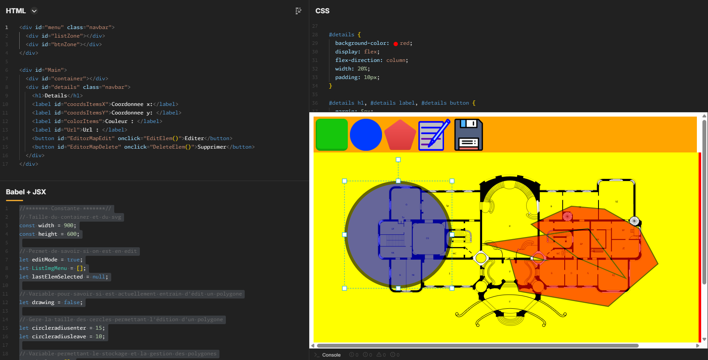

<h1 align="center">
  
</h1>


---

# MapEditor — Dessiner · Lier · Exporter

> ⚠️ **POC (Proof of Concept)** — Ce projet est une preuve de concept pour un futur outil d'édition de cartes interactives. Il n'est pas destiné à la production en l'état.

## Aperçu
Éditeur de **cartes interactives** dans le navigateur, sans build ni installation. À partir d'un **plan en image de fond**, l'outil permet de placer des **zones cliquables** — rectangles, cercles ou polygones — et d'associer à chacune une **URL**. On obtient ainsi une véritable « image map » : un double-clic sur une zone ouvre le lien correspondant. Le tout se pilote depuis une interface unifiée (menu d'outils, plan zoomable, panneau de détails) et l'état complet de la carte peut être **exporté en JSON**. Le rendu repose sur **Konva.js**.

## Fonctionnalités

### ① Plan de fond (zoom & déplacement)
- Chargement d'un **plan** en image de fond sur un canvas Konva
- **Zoom** à la molette (centré sur le curseur) et **déplacement** (drag) du plan
- Recentrage automatique du plan au démarrage

### ② Ajout de zones (Rectangle / Cercle / Polygone)
- **Rectangle** (vert) et **cercle** (bleu) ajoutés en un clic depuis le menu d'outils
- **Polygone** dessiné point par point : un clic pose chaque sommet, un **double-clic** (ou un clic sur le premier point) ferme la forme
- Aperçu en temps réel du polygone pendant le tracé
- Chaque zone porte une **URL** (`href`) pour la rendre cliquable

### ③ Mode édition
- Bascule **édition / consultation** via un bouton dédié
- En mode édition : **déplacement**, **redimensionnement** et **rotation** des zones (via *Transformer*)
- En mode consultation : les zones sont **figées**, seul le double-clic vers l'URL reste actif
- La création d'un polygone verrouille temporairement le changement de mode

### ④ Panneau de détails
- Affiche pour la zone sélectionnée : **coordonnées x / y**, **couleur** et **URL**
- Bouton **Éditer** (re-modifier les sommets d'un polygone existant)
- Bouton **Supprimer** (retire la zone et son *Transformer* associé)
- Mise à jour automatique à la sélection, au déplacement et au relâchement d'une zone

### ⑤ Zones cliquables
- Un **double-clic** sur une zone ouvre son **URL** dans un nouvel onglet
- Permet d'utiliser la carte comme une « image map » interactive

### ⑥ Export JSON
- Sauvegarde de l'**état complet** de la carte (zones, positions, styles) dans un fichier `stage.json`
- Téléchargement déclenché en un clic depuis le menu

## Technologies
- **HTML / CSS / JavaScript** (vanilla, sans framework)
- **[Konva.js](https://konvajs.org/)** (via CDN) — rendu sur canvas et gestion des interactions
- **Canvas 2D** — affichage du plan et des zones

## Installation

**Aucune installation ni build nécessaire.** Le projet est une page HTML autonome :

1. Ouvre `index.html` dans un navigateur web moderne
2. Utilise le menu d'outils pour ajouter des zones, puis le panneau de détails pour les éditer
3. Exporte ta carte en JSON depuis le bouton de sauvegarde

> ℹ️ Une connexion internet est requise : la bibliothèque Konva, le plan de fond et les icônes du menu sont chargés depuis des URL externes (CDN).

## Structure du projet
```
MapEditor/
  index.html          → Page autonome (HTML + CSS + JS regroupés)
  README.md           → Ce fichier
  assets/
    images/github/    → Images du README (header, star, UI)
```

## Pipeline en bref
```
Plan (image de fond)
      │
      ▼
①  Konva Stage ──▶ zoom & déplacement du plan
      │
      ▼
②  Menu d'outils ──▶ Rectangle | Cercle | Polygone (+ URL)
      │
      ▼
③  Mode édition ──▶ déplacer / redimensionner / pivoter
      │
      ▼
④  Panneau détails ──▶ coordonnées · couleur · URL · Éditer / Supprimer
      │
      ▼
⑤  Double-clic ──▶ ouverture de l'URL associée
      │
      ▼
⑥  Export ──▶ ./stage.json
```

## Aperçu de l'interface


## Origine
Ce POC a d'abord été prototypé sur JSFiddle, puis regroupé dans une page HTML unique :
- https://jsfiddle.net/46x891Lo/10/

## Auteur
- [Pierre-Portfolio](https://github.com/Pierre-Portfolio/)

---

<p align="center">Projet réalisé en 2026.</p>
